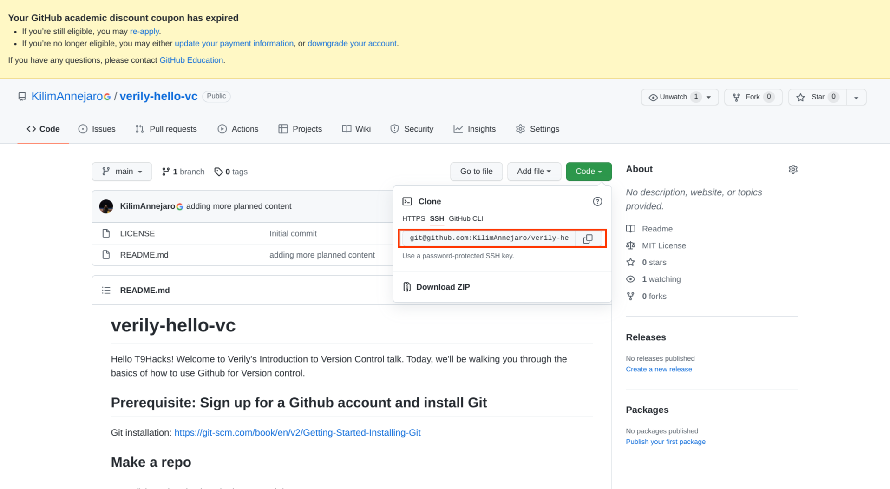

# verily-hello-vc

Hello T9Hacks! Welcome to Verily's Introduction to Version Control talk. Today, we'll be walking you through the basics of how to use Github for Version control.

## Prerequisite: Sign up for a Github account and install Git

Git installation: https://git-scm.com/book/en/v2/Getting-Started-Installing-Git

## Make a repo

If you want to utilize the benefits of version control, you'll need to start by creating a basic organizational unit for the software you want to write: a _repo_.

1. Click on the plus icon in the upper right of any page on GitHub.
2. Click on "New repository".
3. Pick a repository name and add a description.

**NOTE:** Remember to make your repository name short, concise, and descriptive. You'll thank yourself later!

4. Pick a privacy setting (recommended to pick 'Public' for this activity).
5. Initialize the repo.

  - Adding a README provides space for documenting what your code will do.
  - Adding a .gitignore file ensures you don't accidentally commit files you didn't want to.
  - Open source licensing is optional for this activity. We've added a link to the extra credit if you'd like to learn more.

6. Click on "Create repository". You should be taken to the landing page of your repository.

## Clone your repo locally

In this section, we'll show you how to pull this repo down locally so you can write the code in a more convenient environment than the web text editor.

**NOTE:** This section provides instruction on how to clone your repository with SSH. If that isn't working for you, feel free to clone with the HTTPS option instead. (Currently, SSH is considered best practice for security reasons.)

- Click on the "Clone" button in the upper right corner of your newly created repository, then choose the SSH option.

- Create a key if you don't have one. To do this, start by going into your settings and clicking on "SSH and GPG keys". There should be an option to add a new key, which will take you to this page:

From there, follow these directions to construct an SSH key: https://docs.github.com/en/authentication/connecting-to-github-with-ssh/generating-a-new-ssh-key-and-adding-it-to-the-ssh-agent. After you've generated a key locally, use the Linux `cat` command to output the file to your terminal. Copy the output and paste into the new SSH key box that we saw earlier.
- Follow these directions to test your SSH connection: https://docs.github.com/en/authentication/connecting-to-github-with-ssh/testing-your-ssh-connection
- Finally, you can clone the repo locally! Go back to the main page of this repository and copy the SSH clone link, like this:

Go back to your command line and type `git clone `, then the link you copied. You should be able to see this repo cloned into your home directory (or anywhere you choose to place it).

## Make a branch

One of the most powerful features that developing code with version control offers is the ability to try experiments on your code and save the results without making potentially disasterous changes to your production code. This ability is enabled via _branching_. In this section, we'll walk through creating a branch for code.

- `cd verily-hello-vc`
- `git checkout -b hello-vc-<yourfirstname>-<yourlastname>-<date of birth>` (creates a new branch and changes into it in one go) (provide alternative with branch command first)

## Make a commit
- `touch hello.py`
- add something to the file (hand out slips of paper with different messages)
- `git status` (what this)
- `git add .` (or `git add <file>`)
- `git commit -m <something descriptive>`
- `git push origin hello-vc`

Click on link -> pull request with description.

## Find a friend to approve your pull request!

## Merge your PR

(CI/CD)

## Cleanup
- git branch -D and git pull

## Extra credit
- How version control works: <>
- Open source licensing link: <>
- SSH crypto link: <>
