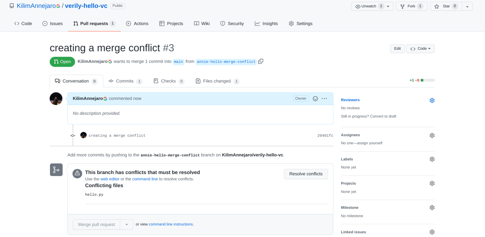

# verily-hello-vc

Hello T9Hacks! Welcome to Verily's Introduction to Version Control talk. Today, we'll be walking you through the basics of how to use Github for Version control.

## A. Prerequisite: Sign up for a Github account and install Git

Git installation: https://git-scm.com/book/en/v2/Getting-Started-Installing-Git

We also need to add you as a collaborator to the Github project.

## B. Fork the Repo

1. Go to https://github.com/KilimAnnejaro/verily-hello-vc ([t.ly/ZqjP](https://t.ly/ZqjP)).

2. Click the fork button in the top right


3. Wait until fork completes


4. 

todo(Annie): update this section

We're now going to move to issues that may arise when you contribute to other people's repositories.

In this section, we'll show you how to pull this repo down locally so you can write the code in a more convenient environment than the web text editor.

> **NOTE:** 
> * This section provides instruction on how to clone your repository with SSH.
>   * If that isn't working for you, feel free to clone with the HTTPS option instead.
>   * SSH is considered best practice for security reasons, and once configured it is very convenient in practice too!
> * If you already have an ssh key configured with your GitHub account, skip ahead to step 10 below.

1. [Create your ssh key](https://docs.github.com/en/authentication/connecting-to-github-with-ssh/generating-a-new-ssh-key-and-adding-it-to-the-ssh-agent), e.g. open a command line (with terminal on Linux and MacOS or Git Bash on Windows) and run `ssh-keygen -t ed25519` while accepting all the defaults by hitting the enter key at each prompt as shown below:

```
$ ssh-keygen -t ed25519
Generating public/private ed25519 key pair.
Enter file in which to save the key (/home/jdimatteo/.ssh/id_ed25519): 
Enter passphrase (empty for no passphrase): 
Enter same passphrase again: 
Your identification has been saved in /home/jdimatteo/.ssh/id_ed25519
Your public key has been saved in /home/jdimatteo/.ssh/id_ed25519.pub
```

2. Copy your **public** key to the clipboard, e.g. back on the command line run `cat ~/.ssh/id_ed25519.pub` then select the printed line and copy it to your clipboard (CTRL-SHIFT-C on Linux and Windows or CMD-C on MacOS). The text should be a long line starting with `ssh-ed25519`. Paste this text to  After you've generated a key locally, use the Linux `cat` command to output the file to your terminal.

3. Open your [GitHub user settings](https://github.com/settings/profile)


4. Drill down to [SSH and GPG keys](https://github.com/settings/keys)


5. Click [New SSH key](https://github.com/settings/ssh/new)


6. Paste your public key (copied to the clipboard in step #2) to the "Key" text box:


7. Click "Add SSH Key"


8. Follow these directions to test your SSH connection: https://docs.github.com/en/authentication/connecting-to-github-with-ssh/testing-your-ssh-connection

9. Finally, you can clone the repo locally with ssh! Go back to the main page of this repository (if you are having trouble finding it, click [Your repositories](https://user-images.githubusercontent.com/3752732/154408379-c6d2c9c5-9b9e-4140-83e5-f3958f4b57c1.png)) and click on the Fork button. This creates a new repo that you own.

10. Click on the "Clone" button in the upper right corner of your newly created repository, then choose the SSH option, then click the copy to clipboard button, like this:


10. Go back to your command line and type `git clone ` followed by pasting your clipboard (CTRL-SHIFT-V on Linux and Windows or CMD-V on MacOS).

11. You should now be able to see this repo cloned into your home directory (or anywhere you choose to place it).

todo(Annie): below used to be section "C. Make a branch" -- should we delete this section?

One of the most powerful features that developing code with version control offers is the ability to try experiments on your code and save the results without making potentially disasterous changes to your production code. This ability is enabled via _branching_. In this section, we'll walk through creating a branch for code.

1. If you haven't already, change directory into the repository you cloned using the `cd` command on the command line.
2. To create a branch, use the command `git branch <your branch name>`. You can check it was created by running the `git branch` command without any options and checking that the output contains the name of your branch.
3. To move into your code branch, you can use the command `git checkout <your branch name>`.

**TIP:** You can combine the above two commands into one with the syntax `git checkout -b <your branch name>`.

## C. Make a commit and create a pull request

You can save changes to your code by making commits. Let's walk through a typical process of making a change and committing it. (Before you start, make sure you're still in the branch you created above!)

1. Start by creating a new file, using `touch hello.py` or a command / text editor of your choice.

2. Add a print statement to the file, like `print("hello <your name>")`.

3. Using the command `git status`, you can see the new file you created and a notation of its status, e.g.


- "Untracked" indicates the addition of a new file. If instead you had chosen to change an already existing file (like the README), the file would be listed as "Modified".

4. To add all changed files to the list, use the command `git add .` If you only want to add a specific file to the commit, replace the `.` with the file name

5. Use `git status` again and check what files are set to be added to the commit. If you've added something you don't want, this is an easy place to remove the undesired change from the commit (using the prompt from terminal output).


6. Next, you'll need to add the commit to your history. You can use the command `git commit -m "<something descriptive>"` for this.

7. Finally, you'll be able to create a pull request for your commit! The command is `git push origin <your branch name>`. You'll see a link in the terminal to create a pull request on Github. Follow the link and fill out the form.


*Congratulations, you've made a pull request!*

## F. Fix a merge conflict

So you've done the hard work to write the code for your latest, greatest invention. You create a pull request on Github--and then you meet with this nasty message:



What to do? Today, we'll use the Github web interface to fix the merge conflict. (You can also fix the merge conflict from the command line.) Click on the big "Resolve conflicts" button. Update the code to the version you're looking to merge. (Be sure to remove the inequality signs before merging!) When you're done, click on "Mark as resolved", then "Commit merge".

## G. Find a friend to approve your pull request!

Here at Verily, we very strongly believe in the concept of _two-party control_. The basic idea behind this is that no one person should be able to make a possibly devastating change to the codebase--instead, all changes must be approved by two parties. Version control enables this by implementing an approval mechanism; we'll walk you through how Github does this.

1. Click on the upper right of your new pull request. You should see an option to request a review on the PR you just created. Turn to the person next to you and ask them for their Github username, then add them as an approver.
2. When you get a pull request to approve, **!TODO figure this out at test run**

## H. Merge your PR

(CI/CD)

## I. Optional: fix a commit that went wrong

So far in this tutorial, we've mostly discussed the happy path: you code something cool, then submit it for review. But what happens if you submit a commit you don't want? Version control with git offers us a way to fix this issue!

Prerequisite: creating a commit that you don't like.

1. Run the command `git log` to print a list of all commits, then copy to clipboard the hash of the commit preceding the one you want to remove. Type `q` at the command prompt to return to your command line interface.
2. There are a lot of ways to roll back commits you don't want; some of them are detailed at <https://stackoverflow.com/questions/4114095/how-do-i-revert-a-git-repository-to-a-previous-commit>. In this lesson, we're going to assume that you don't want your bad commit at all and that you never want to see it again.
3. The command for completely wiping out your bad commit is `git reset --hard <hash-1>` where `<hash-1>` is the hash of the commit preceding the one you want to remove.
4. If you've already pushed bad code to a pull request, you can use the force push option to push the branch with the bad commit removed to origin. The command is `git push -f origin <branch-name>`.

## J. Cleanup

To keep your local clone neat and tidy, you'll want to wrap up your development for the day with some cleanup. You can delete your working branch with the option -D (as in, `git branch -D <branch-name>`) and update your local clone using the `git pull` command, which pulls the latest code from the remote repository.

## K. Extra credit
- How version control works: <https://git-scm.com/book/en/v2/Git-Internals-Plumbing-and-Porcelain>
- Open source licensing link: <https://opensource.org/faq>
